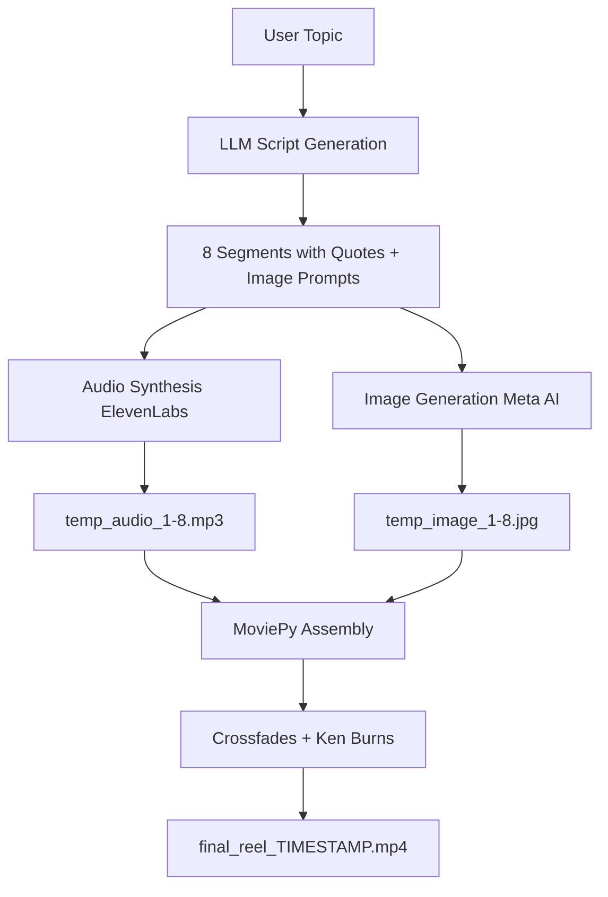

# 🎬 Cinematic Slideshow Pipeline ("Poetic Reels")

A revolutionary **line-by-line** video generation system that creates high-engagement quote reels where visuals subtly shift to match each narration segment.

---

## 🌟 Overview

The Cinematic Slideshow Pipeline generates vertical (9:16) video reels by:
1. **Breaking down philosophical quotes** into 6-8 distinct segments
2. **Generating unique images** for each line using metaphorical prompts
3. **Synthesizing audio narration** for each segment via ElevenLabs
4. **Assembling the final reel** with cinematic crossfades and Ken Burns effects

---

## 🎨 Available Styles

### `minimalist_dark`
- **Aesthetic**: Grainy film texture, heavy silhouettes, dark atmosphere
- **Lighting**: Golden hour, muted tones
- **Composition**: Mid-to-far shots, minimalist characters
- **Use Case**: Melancholic, introspective content

### `oil_painting`
- **Aesthetic**: Living oil painting with heavy brushstrokes
- **Lighting**: Chiaroscuro (dramatic light/shadow contrast)
- **Composition**: Classical museum-quality compositions
- **Use Case**: Timeless, artistic narratives

### `nostalgic_oil` ✨ **NEW**
- **Aesthetic**: Early 20th century European oil painting
- **Lighting**: Soft warm lighting, muted earth tones
- **Composition**: Textured brush strokes, museum painting style
- **Use Case**: Nostalgic, romantic, classical themes

---

## 🚀 Usage

### Basic Generation
```bash
python generate_reel.py --topic "The Beauty of Unspoken Love" --style nostalgic_oil
```

### Dry Run (Script Preview Only)
```bash
python generate_reel.py --topic "Your Topic" --style minimalist_dark --dry-run
```

---

## 📋 Technical Workflow



---

## 🎯 Key Features

### 1. **Metaphorical Diversity**
Each segment features a **distinct subject/setting** to match the emotional arc:
- Line 1: Lighthouse in storm
- Line 2: Abandoned opera house
- Line 3: Ancient trees on moor
- ...and so on

### 2. **Cinematic Transitions**
- **3-3.5 second crossfades** for dreamlike flow
- **Ken Burns effect** (subtle zoom) for visual dynamism
- **Consistent mood** across all segments

### 3. **Smart Resume**
The script automatically **skips regeneration** of existing media files, allowing instant iteration on assembly logic.

---

## 🧩 Architecture

### Core Script: `generate_reel.py`

**Key Functions:**
- `generate_script(topic)`: LLM-powered script generation with retry logic
- `generate_audio_segment(text, index)`: ElevenLabs TTS for each line
- `main()`: Orchestrates the full pipeline

**Style Configuration:**
```python
STYLES = {
    "nostalgic_oil": {
        "visual_prompt": "early 20th century oil painting, soft warm lighting...",
        "ken_burns_speed": 1.05,
        "crossfade_duration": 3.5
    }
}
```

### Dependencies
- **OpenRouter API**: LLM script generation (Gemini 2.0 Flash)
- **ElevenLabs API**: Voice synthesis (Model: `eleven_multilingual_v2`)
- **Meta AI API**: Image generation (Vertical 9:16)
- **MoviePy v2.0+**: Video assembly and effects

---

## 📦 Output Structure

```
C:\Users\YACIN\Desktop\test\test\
├── temp_audio_1.mp3 ... temp_audio_8.mp3  # Cached audio segments
├── temp_image_1.jpg ... temp_image_8.jpg  # Cached images
└── final_reel_1771204378.mp4              # Final assembled reel
```

---

## 🎨 Customization Guide

### Adding a New Style

1. **Edit `generate_reel.py`:**
```python
STYLES = {
    # ... existing styles ...
    "your_style_name": {
        "visual_prompt": "your detailed prompt here",
        "ken_burns_speed": 1.05,  # 1.0 = no zoom, 1.1 = gentle zoom
        "crossfade_duration": 3.5  # seconds
    }
}
```

2. **Run with your new style:**
```bash
python generate_reel.py --topic "Your Topic" --style your_style_name
```

### Adjusting Narration Speed
Modify `voice_settings` in `generate_audio_segment()`:
```python
"voice_settings": {
    "stability": 0.7,        # 0.0-1.0 (higher = more consistent)
    "similarity_boost": 0.8  # 0.0-1.0 (higher = closer to original voice)
}
```

---

## 🔧 Troubleshooting

### Issue: "ModuleNotFoundError: No module named 'moviepy.editor'"
**Solution:** The script uses MoviePy v2.0+ syntax. Ensure you have the correct version:
```bash
pip install moviepy
```

### Issue: "401 Unauthorized" (ElevenLabs)
**Solution:** Update your API key in `.env`:
```
ELEVENLABS_API_KEY=sk_your_actual_key_here
```

### Issue: Images not generating
**Solution:** Verify Meta AI cookies in `generate_reel.py` are valid. Update the `cookies` dictionary if needed.

---

## 📊 Performance Notes

- **Average generation time**: ~8-12 minutes for 8 segments
- **Image generation**: ~60-90 seconds per image (Meta AI latency)
- **Audio generation**: ~3-5 seconds per segment
- **Video assembly**: ~30-60 seconds (depends on segment count)

---

## 🎓 Best Practices

1. **Topic Selection**: Choose philosophical, emotional themes for maximum engagement
2. **Style Matching**: Use `nostalgic_oil` for romantic/classical topics, `minimalist_dark` for melancholic themes
3. **Iteration**: Use `--dry-run` to preview scripts before full generation
4. **Cleanup**: Delete `temp_*.jpg` and `temp_*.mp3` files between different topics to force fresh generation

---

## 📝 Example Output

**Topic:** "The Beauty of Unspoken Love"  
**Style:** `nostalgic_oil`  
**Segments:** 8  
**Duration:** ~40 seconds  
**Resolution:** 1080x1920 (Vertical)

**Sample Script Segment:**
```json
{
  "line": "Love is not a shout into the void...",
  "image_prompt": "A solitary lighthouse standing firm against crashing dark waves at twilight"
}
```

---

## 🚀 Future Enhancements

- [ ] Support for custom voice IDs
- [ ] Batch generation for multiple topics
- [ ] Automated thumbnail extraction
- [ ] Integration with social media APIs for direct upload
- [ ] Real-time preview during generation

---

**Created:** 2026-02-16  
**Version:** 1.0.0  
**Branch:** `oil-style`
