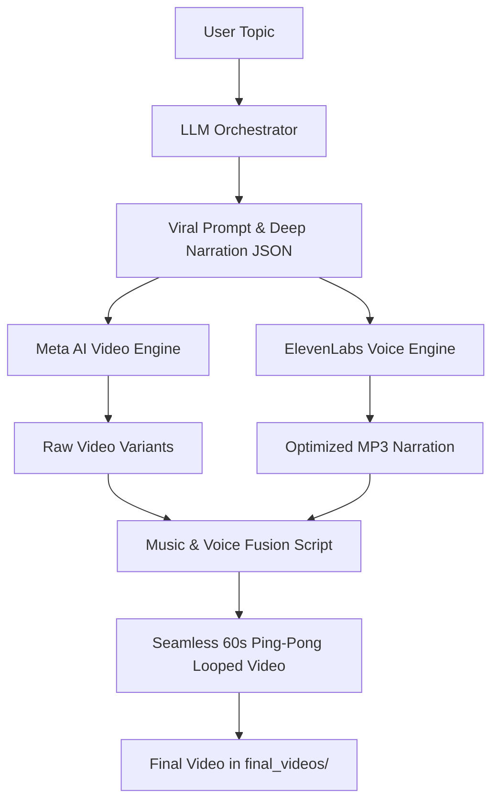

# 🌙 Lofi Video Automation Pipeline

An industrial-grade, automated end-to-end system for generating viral videos for TikTok, YouTube Shorts, and Instagram Reels.

**Two Powerful Pipelines:**
1. **Lofi Loop Generator**: 2D Anime/Studio Ghibli style seamless looping videos with AI narration
2. **Cinematic Slideshow**: Line-by-line quote reels or **famous poetry** with metaphorical imagery and cinematic transitions

---

## 🚀 The Full Flow


---

## ✨ Key Features

### 1. 🧠 Intelligent Prompt Engineering
*   **Aesthetic Enforcement**: Mandates 2D Anime/Ghibli style. Forbids photorealism.
*   **Loop Stability**: Enforces fixed camera angles and cyclical motions (steam, rain, flickering).
*   **Viral Narrative Hooks**: Generates deep, 3-5 sentence philosophical "pitches" designed to trend on social media.

### 2. 🎙️ AI Voice-Over & Audio Ducking
*   **Optimized Narration**: Integrated with **ElevenLabs**. Defaulting to **George**—tuned for a wise, calm, and 20% slower delivery style.
*   **Professional Audio Ducking**: The system automatically reduces background music volume to **20%** while the narrator is speaking, ensuring the "Lofi Vibe" remains while making the voice crystal clear.

### 3. 🎵 Automated Seamless Looping
*   **Ping-Pong Logic**: Automatically reverses video segments to create an infinite, seamless 60-second loop.
*   **Randomized Fusion**: Each generation selects a different random track from your `music/` folder for endless variety.

---

## 🛠️ Project Structure

*   `generate_prompt.py`: **The Brain.** Orchestrates the entire pipeline from LLM to final rendering.
*   `voice_engine.py`: **The Voice.** Handles deep narration generation via ElevenLabs.
*   `video.py`: **The Artist.** Communicates with Meta AI to create visuals.
*   `addMusic.py`: **The Editor.** Handles the audio ducking, mixing, and ping-pong looping.
*   `music/`: Put your Lofi `.mp3` files here.
*   `final_videos/`: Your ready-to-upload masterpieces.

---

## 🚦 Setup & Usage

### 1. Environment Variables
Create a `.env` file or set the following environment variables:
*   `OPENROUTER_API_KEY`: Your key for LLM access.
*   `ELEVEN_API_KEY`: Your ElevenLabs API key.

### 2. Prerequisites
*   **FFmpeg**: Must be installed and in your system PATH (Project defaults to `C:\ffmpeg\bin`).
*   **Python Dependencies**:
    ```bash
    pip install metaai-api requests moviepy python-dotenv
    ```

### 3. Running the Pipeline
**Default (Visuals + Music):**
```bash
python generate_prompt.py --topic "mountain cabin night"
```

**Viral TikTok Flow (Visuals + Wise Narration + Ducked Music):**
```bash
python generate_prompt.py --topic "cyberpunk rain solitude" --voice
```

---

## �️ Technical Deep-Dive & Troubleshooting

### 1. Meta AI Authentication
The `video.py` engine uses an unofficial Meta AI wrapper. To keep it functional:
*   **Cookie Session**: You must provide valid `datr`, `abra_sess`, and `ecto_1_sess` cookies in the `video.py` scripts.
*   **Refresh**: If video generation fails with a 401 or authentication error, log into [Meta AI](https://www.meta.ai/) in your browser, inspect the network requests, and copy the new cookie values into the script.

### 2. FFmpeg & MoviePy (Windows Setup)
We encountered and resolved several critical audio processing issues:
*   **"FFmpeg not found"**: Even if installed, MoviePy sometimes fails to locate the binary. We fixed this by explicitly adding the path to `os.environ["PATH"]` within `voice_engine.py` and `addMusic.py`.
    ```python
    os.environ["PATH"] += os.pathsep + r"C:\ffmpeg\bin"
    ```
*   **MoviePy v2.x Compatibility**: Modern versions of MoviePy (v2.0+) have renamed many methods. 
    *   Use `.with_volume_scaled(0.2)` instead of the legacy `.volumex(0.2)`.
    *   Use `.with_start(0)` for composite audio clips.
    *   Always set `.with_duration()` when using `CompositeAudioClip` to avoid empty audio output.

### 3. ElevenLabs API Permissions
*   **Shared Voices**: Some shared voices require specific "Voice Lab" permissions. If a voice ID fails, ensure it is added to your account's "My Voices" library first.
*   **Stock Voices**: Use reliable stock IDs like `JBFqnCBsd6RMkjVDRZzb` (George) for the most stable experience.

---

## 📈 Advanced Features
*   **Dry Run**: Use `--dry-run` to see the generated prompt and narration without spending API credits on video/voice.
*   **Voice Customization**: Edit `voice_engine.py` to change the default speaker ID or adjust the stability/speed settings.
*   **n8n Automation**: This pipeline is designed to be triggered via webhooks for 100% hands-free content creation.

---

## 📚 Documentation

### Pipeline-Specific Guides
- **[Cinematic Slideshow Pipeline](CINEMATIC_SLIDESHOW.md)** - Complete guide for the new line-by-line quote reel generator
  - Available styles: `minimalist_dark`, `oil_painting`, `nostalgic_oil`
  - Customization, troubleshooting, and best practices

### Testing & Debugging
- **[Testing Tools](TESTING.md)** - Standalone Meta AI testing scripts
  - `test_meta_video.py`: Test video generation with style presets
  - `diagnose_meta.py`: Cookie validation and diagnostic tool
  - Cookie management and troubleshooting guide

### Legacy Documentation
- **Lofi Loop Generator** - See sections above for the original seamless looping pipeline

---

## 📄 License
MIT License. Created for the next generation of automated content creators.
